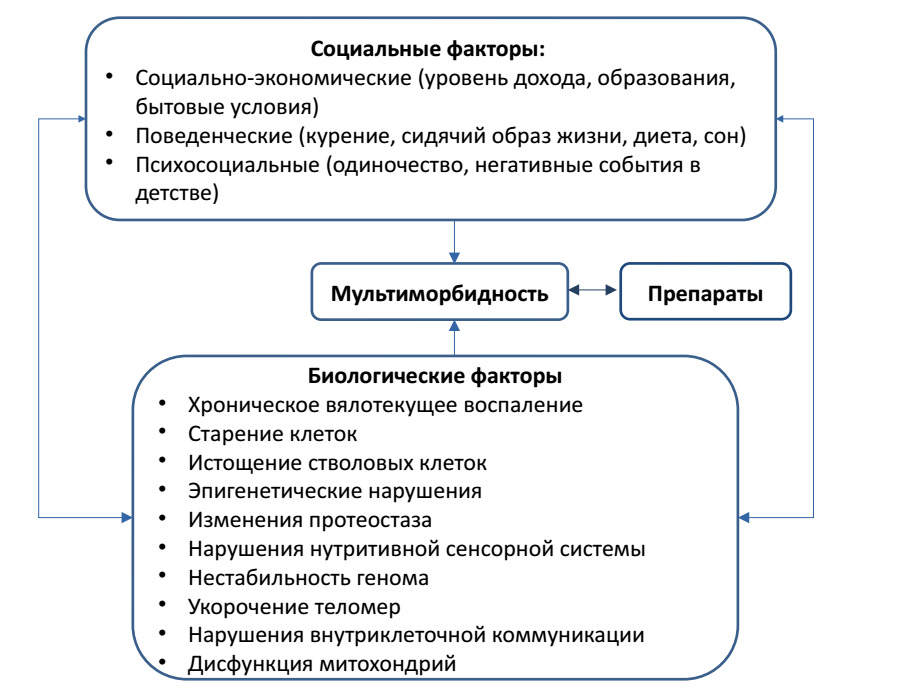

[← Главная страница](https://ivan-shirinsky.github.io/)
# Современные проблемы мультиморбидности

## Current issues in multimorbidity

Open-access scholarly review

Открытый научный обзор

*This review is made freely available online to support open scientific communication and broader dissemination of current concepts in multimorbidity research.*

*Обзор размещён в открытом доступе с целью поддержки свободного научного обмена и более широкого распространения современных представлений о мультиморбидности.*

DOI: [10.5281/zenodo.20392649](https://doi.org/10.5281/zenodo.20392649)

[View on Zenodo](https://zenodo.org/records/20392649)

[Download PDF](multimorbidity_paper.pdf)

<!-- Метатеги для индексации в Google Scholar (Google Академия) -->
<!-- Русскоязычная версия -->
<meta name="citation_title" content="Современные проблемы мультиморбидности">
<meta name="citation_author" content="Ширинский, И. В.">
<meta name="citation_author" content="Ширинский, В. С.">
<meta name="citation_publication_date" content="2026">
<meta name="citation_online_date" content="2026/05/26">
<meta name="citation_pdf_url" content="https://zenodo.org/files/multimorbidity_paper.pdf">
<meta name="citation_doi" content="10.5281/zenodo.20392649">
<meta name="citation_abstract_html_url" content="https://github.iomultimorbidity-review/">

<!-- Англоязычная версия для международного поиска -->
<meta name="citation_title" content="Modern Challenges of Multimorbidity Research">
<meta name="citation_author" content="Shirinsky, Ivan">
<meta name="citation_author" content="Shirinsky, Valery">
<!-- Конец блока Google Scholar -->

## Authors / Авторы

**Ivan Shirinsky / И.В. Ширинский**  
[https://orcid.org/0000-0002-8603-3406](https://orcid.org/0000-0002-8603-3406)

**Valery Shirinsky / В.С. Ширинский**  
[https://orcid.org/0000-0002-4922-9303](https://orcid.org/0000-0002-4922-9303)

---

## Аннотация

Проблеме мультиморбидности посвящено значительное количество зарубежных и отечественных исследований. Однако в российской литературе сравнительно немного обзорных работ, обобщающих современные данные по этой теме. Цель настоящего обзора - описание основных современных проблем в изучении мультиморбидности. В качестве источников использованы оригинальные и обзорные статьи из баз данных PubMed и РИНЦ, посвящённые эпидемиологии, факторам риска, механизмам развития, клиническим исходам и подходам к лечению. Формализованная стратегия поиска не применялась. Обзор не ставит задачи исчерпывающего освещения всех аспектов мультиморбидности; акцент сделан на направлениях, наиболее значимых для клинической практики и дальнейших исследований, а также наименее отражённых в современной российской литературе.

Проанализированы данные о связи распространённости мультиморбидности с возрастом, полом, социально-экономическими условиями и уровнем образования. Рассмотрены кластеры мультиморбидности, их динамика и клиническое значение, а также методические трудности их описания. Особое внимание уделено сочетаниям заболеваний с преобладанием мышечно-скелетных болезней и синтропиям - генетически и патогенетически обусловленным комбинациям болезней.

Обсуждаются молекулярно-генетические механизмы, включая изменения иммунной и нейроэндокринной систем, хроническое воспаление, эпигенетические нарушения, укорочение теломер, митохондриальную дисфункцию, клеточное старение и истощение стволовых клеток. Отдельно анализируется роль социально-экономических, психосоциальных и поведенческих детерминант, а также влияние лекарственной терапии и полипрагмазии на формирование мультиморбидности.

Заключается, что требуется интенсификация исследований этиологических факторов, закономерностей формирования кластеров и молекулярно-генетических механизмов, а также поиск эффективных и экономически обоснованных моделей ведения пациентов с несколькими хроническими заболеваниями в рамках пациент-ориентированного подхода.

## Abstract

A considerable number of international and Russian studies have addressed the issue of multimorbidity. However, in the Russian literature, there are relatively few review papers that synthesize current knowledge on this topic. The purpose of the present review is to outline the major contemporary challenges in the study of multimorbidity. As sources, we used original and review articles from PubMed and the Russian Science Citation Index (RSCI), focusing on epidemiology, risk factors, pathophysiological mechanisms, clinical outcomes, and treatment approaches. A formal search strategy was not applied. This review does not aim to provide an exhaustive account of all aspects of multimorbidity; instead, it emphasizes areas of greatest relevance to clinical practice and future research, as well as those least represented in the current Russian literature.

The data analyzed include associations of multimorbidity prevalence with age, sex, socioeconomic status, and educational level. We discuss clusters of multimorbidity, their dynamics, and clinical significance, along with methodological difficulties in their characterization. Particular attention is given to disease combinations dominated by musculoskeletal disorders and to syntropies - genetically and pathogenetically determined constellations of diseases.

Molecular and genetic mechanisms are also considered, including alterations of the immune and neuroendocrine systems, chronic low-grade inflammation, epigenetic dysregulation, telomere shortening, mitochondrial dysfunction, cellular senescence, and stem cell exhaustion. The review further addresses the role of socioeconomic, psychosocial, and behavioral determinants, as well as the contribution of pharmacotherapy and polypharmacy to the development of multimorbidity.

In conclusion, intensified research is needed to elucidate etiological factors, patterns of cluster formation, and molecular–genetic mechanisms, as well as to identify effective and economically sustainable models for the management of patients with multiple chronic conditions within a patient-centered framework.
                                                                                                                                                                                                                                         
## Citation / Как цитировать
 
**English**

Shirinsky I, Shirinsky V. *Modern Challenges of Multimorbidity Research*. Zenodo; 2026.  
https://doi.org/10.5281/zenodo.20392649

**Русский**

Ширинский И.В., Ширинский В.С. *Современные проблемы мультиморбидности*. Zenodo; 2026.  
https://doi.org/10.5281/zenodo.20392649

## Keywords

multimorbidity; comorbidity; polymorbidity; chronic diseases; multimorbidity clusters; polypharmacy; chronic pain; musculoskeletal disorders; osteoarthritis; aging; inflammaging; frailty; patient-centered care; social determinants of health; multimorbidity management

## Ключевые слова

мультиморбидность; коморбидность; полиморбидность; множественные хронические заболевания; кластеры мультиморбидности; полипрагмазия; хроническая боль; заболевания опорно-двигательного аппарата; остеоартрит; старение; иммунное старение; inflammaging; синдемия; синтропия; социальные детерминанты здоровья; биопсихосоциальная модель; пациент-ориентированный подход; качество жизни; гериатрия; внутренняя медицина; хрупкость; ведение мультиморбидности

## License

This work is licensed under a Creative Commons Attribution 4.0 International License (CC BY 4.0).

https://creativecommons.org/licenses/by/4.0/        

## Full text / Полный текст

---
keywords:
  - мультиморбидность
  - коморбидность
  - полиморбидность
  - множественные хронические заболевания
  - сочетанная патология
  - кластеры мультиморбидности
  - хронические заболевания
  - полипрагмазия
  - хроническая боль
  - заболевания опорно-двигательного аппарата
  - остеоартрит
  - старение
  - иммунное старение
  - вялотекущее воспаление
  - inflammaging
  - синдемия
  - синтропия
  - социальные детерминанты здоровья
  - биопсихосоциальная модель
  - пациент-ориентированный подход
  - качество жизни
  - гериатрия
  - внутренняя медицина
  - хрупкость
  - ведение мультиморбидности
  - multimorbidity
  - comorbidity
  - polymorbidity
  - chronic diseases
  - multimorbidity clusters
  - polypharmacy
  - chronic pain
  - musculoskeletal disorders
  - osteoarthritis
  - inflammaging
  - patient-centered care
  - social determinants of health
  - geriatrics 
  - internal medicine
  - aging
  - frailty
  - multimorbidity management

Subject : Обзор литературы по мультиморбидности

lang: ru-RU
babel-lang: russian

fontsize: 12pt
geometry: margin=2.5cm

mainfont: "Liberation Serif"
sansfont: "Liberation Sans"
monofont: "Liberation Mono"

header-includes:
  - \emergencystretch=5em

numbersections: false
---

\begin{titlepage}
\centering

\vspace*{0.20\textheight}

{\Huge Современные проблемы мультиморбидности\par}

\vspace{1cm}

{\Large Обзор литературы\par}

\vspace{2cm}

{\Huge Current issues in multimorbidity\par}

\vspace{0.5cm}

{\Large A literature review\par}

\vspace{2cm}

{\large В.С. Ширинский, И.В. Ширинский\par}

\vspace{0.5cm}

{\large V.S. Shirinsky, I.V. Shirinsky\par}

\vspace{0.5cm}

{\normalsize
НИИ терапии и профилактической медицины — филиал ИЦиГ СО РАН, Новосибирск, Россия\par
}

\vfill

{\Large 2026\par}

\end{titlepage}

\newpage

## Резюме

Проблеме мультиморбидности посвящено значительное количество зарубежных и отечественных исследований. Однако в российской литературе сравнительно немного обзорных работ, обобщающих современные данные по этой теме. Цель настоящего обзора - описание основных современных проблем в изучении мультиморбидности. В качестве источников использованы оригинальные и обзорные статьи из баз данных PubMed и РИНЦ, посвящённые эпидемиологии, факторам риска, механизмам развития, клиническим исходам и подходам к лечению. Формализованная стратегия поиска не применялась. Обзор не ставит задачи исчерпывающего освещения всех аспектов мультиморбидности; акцент сделан на направлениях, наиболее значимых для клинической практики и дальнейших исследований, а также наименее отражённых в современной российской литературе.

Проанализированы данные о связи распространённости мультиморбидности с возрастом, полом, социально-экономическими условиями и уровнем образования. Рассмотрены кластеры мультиморбидности, их динамика и клиническое значение, а также методические трудности их описания. Особое внимание уделено сочетаниям заболеваний с преобладанием мышечно-скелетных болезней и синтропиям - генетически и патогенетически обусловленным комбинациям болезней.

Обсуждаются молекулярно-генетические механизмы, включая изменения иммунной и нейроэндокринной систем, хроническое воспаление, эпигенетические нарушения, укорочение теломер, митохондриальную дисфункцию, клеточное старение и истощение стволовых клеток. Отдельно анализируется роль социально-экономических, психосоциальных и поведенческих детерминант, а также влияние лекарственной терапии и полипрагмазии на формирование мультиморбидности.

Заключается, что требуется интенсификация исследований этиологических факторов, закономерностей формирования кластеров и молекулярно-генетических механизмов, а также поиск эффективных и экономически обоснованных моделей ведения пациентов с несколькими хроническими заболеваниями в рамках пациент-ориентированного подхода.

\newpage

## Abstract

A considerable number of international and Russian studies have addressed the issue of multimorbidity. However, in the Russian literature, there are relatively few review papers that synthesize current knowledge on this topic. The purpose of the present review is to outline the major contemporary challenges in the study of multimorbidity. As sources, we used original and review articles from PubMed and the Russian Science Citation Index (RSCI), focusing on epidemiology, risk factors, pathophysiological mechanisms, clinical outcomes, and treatment approaches. A formal search strategy was not applied. This review does not aim to provide an exhaustive account of all aspects of multimorbidity; instead, it emphasizes areas of greatest relevance to clinical practice and future research, as well as those least represented in the current Russian literature.

The data analyzed include associations of multimorbidity prevalence with age, sex, socioeconomic status, and educational level. We discuss clusters of multimorbidity, their dynamics, and clinical significance, along with methodological difficulties in their characterization. Particular attention is given to disease combinations dominated by musculoskeletal disorders and to syntropies - genetically and pathogenetically determined constellations of diseases.

Molecular and genetic mechanisms are also considered, including alterations of the immune and neuroendocrine systems, chronic low-grade inflammation, epigenetic dysregulation, telomere shortening, mitochondrial dysfunction, cellular senescence, and stem cell exhaustion. The review further addresses the role of socioeconomic, psychosocial, and behavioral determinants, as well as the contribution of pharmacotherapy and polypharmacy to the development of multimorbidity.

In conclusion, intensified research is needed to elucidate etiological factors, patterns of cluster formation, and molecular–genetic mechanisms, as well as to identify effective and economically sustainable models for the management of patients with multiple chronic conditions within a patient-centered framework.

\newpage

## Введение

В последние годы наблюдается значительный рост интереса к проблеме мультиморбидности вследствие её выраженного неблагоприятного воздействия на человека, его семью, систему здравоохранения и общество в целом, особенно в условиях дефицита ресурсов [1]. Пациенты с мультиморбидностью чаще умирают преждевременно, имеют более высокую вероятность госпитализации и проводят в стационаре больше времени по сравнению с больными, страдающими одним хроническим заболеванием [2]. Мультиморбидность ассоциируется с ухудшением качества жизни, развитием депрессии, полипрагмазией, ограничениями трудовой деятельности [3], а также значительными социально-экономическими издержками [4].

Серьёзная проблема заключается в том, что большинство медицинских вмешательств ориентировано на отдельные заболевания, а не на комплексное, пациент-ориентированное ведение [1]. Распространённость мультиморбидности продолжает расти в связи с изменениями факторов риска образа жизни, включая снижение физической активности, ожирение и старение населения [5]. Особенно тяжёлые последствия мультиморбидности отмечаются в странах с низким и средним уровнем дохода [5,6].

Во время пандемии COVID-19 лица с мультиморбидностью имели более высокий риск инфицирования, чаще нуждались в госпитализации и демонстрировали неблагоприятные исходы [7]. Эти обстоятельства подчеркнули необходимость разработки глобальных стратегий по борьбе с нарастающим бременем хронических заболеваний и мультиморбидности [7].

В настоящем обзоре представлен краткий анализ распространённости, факторов риска, кластеризации, исходов, патогенетических механизмов и особенностей ведения пациентов с мультиморбидностью. Основная цель обзора - привлечь внимание исследователей и врачей разных специальностей к ключевым современным проблемам: унификации методов кластеризации мультиморбидности; изучению молекулярно-генетических механизмов её развития; учёту социально-экономических и поведенческих факторов; разработке эффективных комплексных программ ведения пациентов на основе биопсихосоциального, пациент-ориентированного подхода.
Цель обзора заключается не в полном охвате темы мультиморбидности, а в выделении наиболее значимых для клинической практики и научного поиска направлений, которые в отечественной литературе освещены пока недостаточно.

**Распространенность и социально-экономические, поведенческие факторы риска мультиморбидности**

Анализировались данные, полученные в рамках исследования ВОЗ «Глобальное старение и здоровье взрослых» (SAGE), первая волна 2007–2010 гг. [8]. Это было поперечное популяционное исследование, проведённое в странах с низким и средним уровнем дохода - Китае, Гане, Индии, Мексике, России и Южной Африке. В исследование было включено 42 236 взрослых в возрасте 18 лет и старше. Мультиморбидность определялась как одновременное наличие двух и более из восьми хронических заболеваний: стенокардии, артрита, астмы, хронических заболеваний лёгких, сахарного диабета, гипертонии, инсульта и нарушений зрения.

Распространённость отдельных заболеваний и мультиморбидности определялась на основе набора вопросов, основанных на симптомах, в сочетании с диагностическим алгоритмом. Дополнительно изучалась их взаимосвязь с четырьмя показателями здоровья: ограничением повседневной активности, самооценкой состояния здоровья, наличием депрессии и индексом качества жизни.
Было установлено, что распространённость отдельных заболеваний и мультиморбидности в объединённой выборке из шести стран составила 54,2% и 21,9% соответственно. В России отмечалась наибольшая распространённость мультиморбидности (34,7%), тогда как в Китае - наименьшая (20,3%). Вероятность мультиморбидности увеличивалась с возрастом и снижалась у лиц с более высоким социально-экономическим статусом.

Полученные результаты подчёркивают значимость проблемы мультиморбидности в странах с низким и средним уровнем дохода, особенно среди групп с низким социально-экономическим статусом, и указывают на необходимость переориентации ресурсов здравоохранения с учётом растущей распространённости мультиморбидности и её неблагоприятного влияния на исходы лечения [8].

Социально-экономические и поведенческие детерминанты здоровья демонстрируют тесную связь с развитием мультиморбидности. Низкий семейный доход, неудовлетворительное общее материальное положение, малая площадь жилья и низкий уровень образования ассоциированы с большей распространённостью мультиморбидности [9], а также с её возникновением в более молодом возрасте [5].

Систематический обзор включил 24 исследования, изучавших взаимосвязь между социально-экономической депривацией, уровнем образования и доходом [9]. Было установлено, что низкий уровень образования повышает риск мультиморбидности на 64% по сравнению с пациентами, имеющими высшее образование. Кроме того, мультиморбидность возникает примерно на десятилетие раньше у людей из социально-экономически неблагополучных семей [5].

В систематическом обзоре Melo L.A. и соавт. были проанализированы факторы, связанные с мультиморбидностью у пожилых людей [10]. Авторы включили семь исследований, в которых распространённость мультиморбидности среди пожилых варьировала от 30,7% до 57%. Риск её развития ассоциировался с пожилым возрастом, женским полом, курением, употреблением алкоголя, проживанием в сельской местности, низким уровнем образования и отсутствием детей. В большинстве исследований также показано, что низкий уровень семейного дохода сопряжён с мультиморбидностью.

В другом систематическом обзоре, посвящённом изучению факторов риска мультиморбидности [11], из 20 806 найденных публикаций было включено 68 исследований с участниками в возрасте от 18 до 105 лет из 23 стран. Авторы выделили девять категорий факторов риска, включая демографические, социально-экономические и поведенческие. Пожилой возраст, низкий уровень образования, ожирение, гипертония, депрессия и низкая физическая активность, как правило, положительно коррелировали с мультиморбидностью. Результаты по таким факторам, как курение, употребление алкоголя и особенности питания, оказались противоречивыми. Авторы предполагают, что ряд факторов устойчиво связан с повышенным риском развития хронических заболеваний с течением времени. Однако неоднородность условий, воздействий и исходов, а также исходного состояния здоровья участников затрудняет формирование однозначных выводов.

В систематическом обзоре Álvarez-Gálvez J. и соавт., включившем 97 исследований, был проведён анализ различных кластеров мультиморбидности и характеристика социальных и поведенческих детерминант, влияющих на их формирование и эволюцию [4]. Авторы установили, что наиболее распространёнными являются кардиометаболические, опорно-двигательные, психические и респираторные кластеры. Кардиометаболические кластеры чаще встречались у мужчин с низким социально-экономическим статусом, тогда как опорно-двигательные, психические и смешанные - у женщин. Употребление алкоголя и курение повышали риск мультиморбидности, особенно у мужчин. Несмотря на очевидную связь мультиморбидности с низким социально-экономическим статусом, были выявлены и кластеры лёгкой мультиморбидности, психических и респираторных заболеваний, характерные для лиц со средним и высоким социально-экономическим статусом. Анализ данных обзора подчёркивает необходимость дальнейших исследований, направленных на изучение влияния социальных детерминант на мультиморбидность в группах населения, где эта проблема остаётся малоизученной (женщины, дети, подростки и молодые люди, этнические меньшинства, инвалиды, пожилые люди, проживающие одни и/или имеющие ограниченные социальные связи).

Следует подчеркнуть, что в регионах с неблагополучным социально-экономическим положением мультиморбидность становится всё более заметной среди молодого населения [1]. Появление COVID-19 и его последствий, известных как «длительный COVID», поражающего одновременно несколько органов и систем, а также распространённость других заболеваний, таких как ВИЧ-инфекция, системные аутоиммунные болезни, рак, диабет и психические расстройства, часто встречающихся у молодых людей, ещё раз подтверждают, что мультиморбидность характерна не только для пожилого возраста [1].

Растёт интерес к изучению новых, потенциально обратимых факторов риска, связанных с образом жизни и играющих важную роль в развитии мультиморбидности [12]. К ним относят длительное время просмотра телевизора и малоподвижный образ жизни, как чрезмерную, так и недостаточную продолжительность сна, а также уровень социального участия (например, одиночество) [5]. Механизмы, лежащие в основе этих ассоциаций, остаются неясными. Исследования взаимодействия между стрессом и мультиморбидностью находятся на начальной стадии, однако ряд работ указывает на наличие такой связи, ассоциированной с повышенным риском госпитализаций и смертности [13].

Медицинские антропологи предложили концепцию «синдемии» (синергии эпидемий), согласно которой заболевания имеют тенденцию группироваться и взаимодействовать не только друг с другом (биолого-биологический интерфейс), но и с социальными и структурными факторами (биолого-социальный интерфейс) [14]. Данная концепция акцентирует внимание как на концентрации (кластерах) болезней, так и на их взаимодействии, которое в совокупности усугубляет состояние здоровья.

Хотя анализ взаимодействия заболеваний на индивидуальном уровне имеет решающее значение для понимания синдемических состояний, чаще всего синдемию рассматривают на популяционном уровне. Формирование таких кластеров заболеваний связано с действием усугубляющих факторов, включая социальное неравенство, неблагоприятные жилищные условия, климатический стресс и ятрогенные эффекты неадаптивных медицинских систем. Подобные сочетания заболеваний нередко предсказуемы, например, ожирение, сахарный диабет и артериальная гипертония.

Примером взаимодействия заболеваний является влияние болезней опорно-двигательного аппарата на формирование мультиморбидности. В одном систематическом обзоре и метаанализе [15] были проанализированы 13 когортных исследований с участием 3 086 612 человек, страдавших хроническими болями в области шеи или спины, а также остеоартритом коленного или тазобедренного суставов. Результаты показали, что у лиц с заболеваниями опорно-двигательного аппарата риск развития хронических заболеваний был на 17% выше по сравнению с людьми без них (отношение шансов 1,17; 95% доверительный интервал 1,13–1,22).

Заключая этот раздел обзора, следует еще раз подчеркнуть глобальную
проблему большой распространенности мультиморбидности, ассоциированную
с различными факторами риска как биологической, так  и не биологической природы. Данных о социальных, экономических и поведенческих детерминантах
мультиморбидности становится все больше, что обуславливает
необходимость биопсихосоциального подхода к решению проблем  мультиморбидности.

**Проблема кластеров мультиморбидности**  
В последние годы увеличивается количество исследований, посвящённых кластерам мультиморбидности - группировкам пациентов, формирующихся вследствие общих факторов риска и/или сходных патофизиологических механизмов, предрасполагающих к развитию нескольких хронических заболеваний [16]. Основная проблема таких исследований заключается в отсутствии унифицированных методов кластеризации мультиморбидных заболеваний.

Систематический обзор, посвящённый моделям мультиморбидности, показал высокую гетерогенность используемых подходов [17]. В анализ было включено 41 исследование, в которых применялись пять различных аналитических методов для выявления кластеров мультиморбидности. Несмотря на выявленную неоднородность данных в рамках каждого метода, удалось определить ключевые сходства между группами пациентов с мультиморбидностью. Наиболее часто воспроизводились следующие кластеры:

1. Сердечно-сосудистые и метаболические заболевания;

2. Нарушения психического здоровья;

3. Аллергические заболевания.

В другом британском исследовании [18], проведённом на двух популяционных когортах, были определены характеристики и распространённость кластеров мультиморбидности, а также их связь с долгосрочным качеством жизни (оценка проводилась в течение 5–10 лет наблюдения). Авторы показали, что кластеры, включавшие заболевания органов дыхания, сердечно-сосудистую и эндокринную патологию, встречались во всех возрастных группах. Гипертоническая болезнь была характерна для всех кластеров и возрастов, тогда как депрессия чаще выявлялась у более молодых пациентов. Болевые мышечно-скелетные синдромы становились распространёнными начиная со среднего возраста. При этом кластеры заболеваний с болевым компонентом и кардиометаболические кластеры оказывали долговременное негативное влияние на качество жизни.
Другие примеры исследований. Так, Bisquera и соавт. (2021) провели ретроспективное поперечное исследование в одном из районов Лондона, характеризовавшемся молодым, многонациональным и социально неблагополучным населением [19]. Были проанализированы электронные медицинские карты 826 936 жителей в возрасте старше 18 лет. Для выявления групп мультиморбидных заболеваний из числа 32 хронических состояний применялись методы анализа множественных соответствий и кластерного анализа. В результате было выделено пять последовательных кластеров:

1. Тревожные расстройства и депрессия;

2. Сердечная недостаточность, фибрилляция предсердий, хроническая болезнь почек, ишемическая болезнь сердца, инсульт/транзиторная ишемическая атака, заболевания периферических артерий, деменция и остеопороз;

3. Остеоартрит, рак, хроническая боль, гипертония и сахарный диабет;

4. Хронические заболевания печени и вирусные гепатиты;

5. Зависимость от психоактивных веществ, алкогольная зависимость и ВИЧ-инфекция.

Следующий пример иллюстрирует особенности кластеров мультиморбидности у лиц старше 50 лет [20]. В исследование были включены 811 пациентов с первичным раком молочной железы, колоректальным раком, раком шейки матки, предстательной железы или лёгких. С помощью факторного анализа были определены кластеры мультиморбидности как среди выживших после рака, так и в контрольной группе лиц без онкологического заболевания в анамнезе. Авторы установили, что выжившие чаще сообщали о наличии четырёх и более хронических болезней по сравнению с контрольной группой (57% против 38%). Было выделено шесть кластеров для выживших после рака и четыре кластера для контрольной группы. При этом три кластера (лёгочные, сердечные и печёночные) включали сходные заболевания в обеих группах. Полученные результаты указывают на то, что у взрослых старше 50 лет наличие онкологического заболевания в анамнезе влияет на структуру сопутствующей патологии, что может служить основой для оптимизации ведения таких пациентов.

Кластеры мультиморбидности являются «подвижными»: существуют определённые траектории их перехода и накопления, что приводит к изменению тяжести состояния и клинических исходов. Так, Dong и соавт. в течение 9 лет наблюдали динамику переходов между кластерами мультиморбидности, исследовали аддиктивные и компенсирующие траектории, а также связь накопления заболеваний с пятилетней смертностью от всех причин [21]. В исследование были включены 8988 пациентов с мультиморбидностью. Авторы выделили пять кластеров: костно-суставной, кардиометаболический, мультисистемный, пищеварительный и респираторный.

У больных с мультисистемной мультиморбидностью и последующим развитием респираторных заболеваний риск смертности оказался в 9 раз выше по сравнению со здоровыми участниками (ОР 9,04; 95% ДИ 3,44–23,73). У пациентов с длительным течением кардиометаболической мультиморбидности риск неблагоприятных исходов возрастал на 26% с каждым дополнительным хроническим заболеванием и на 38% с каждой вовлечённой системой организма в течение пятилетнего периода.

Авторы заключили, что при динамическом наблюдении и планировании вмешательств особое внимание следует уделять пациентам с длительно существующей мультиморбидностью и множественными заболеваниями, особенно при развитии поражения бронхолёгочной системы на фоне мультисистемных состояний, а также больным, у которых на фоне кардиометаболической мультиморбидности появляются новые хронические болезни.

В другой работе была предпринята попытка изучить причинно-следственные связи между распространёнными заболеваниями и прогрессией кластеров мультиморбидности [22]. Авторы оценили 190 заболеваний у более чем 500 000 участников UK Biobank за период 12,7 лет наблюдения. С использованием методов машинного обучения были проанализированы закономерности влияния одних заболеваний на другие, а также выявлены различия по полу.

Полученные результаты продемонстрировали возможность учёта двунаправленных причинно-следственных связей между заболеваниями, что создаёт основу для построения сети траекторий их взаимодействия и выделения общих, патогенетически взаимосвязанных и прогностически значимых кластеров. Разработанная структура и инструменты стали важным шагом в направлении картирования прогрессирования мультиморбидности.

Авторы представили клинически обоснованный перечень ключевых заболеваний, которые необходимо учитывать при анализе мультиморбидности, и показали, что профили для женщин и мужчин в значительной степени совпадают. Такие профили позволяют врачу более точно оценивать риск последующих заболеваний у пациентов без множественной патологии, а также разрабатывать стратегии профилактики и вмешательств, направленные на сдерживание прогрессирования мультиморбидности.

Кластеры мультиморбидности также были описаны у пациентов стационаров [23]. В 2014 году в выборке из 41 545 госпитализированных больных в Шотландии у 11 389 (27%) выявили ≥ 2 хронических заболеваний. С помощью кластерного анализа было определено десять основных групп состояний: гипертония; астма; злоупотребление алкоголем; сочетание хронической болезни почек и сахарного диабета; изолированная хроническая болезнь почек; хроническая боль; онкологические заболевания; хроническая сердечная недостаточность; сахарный диабет; гипотиреоз. Средний возраст пациентов в различных кластерах варьировал от 51 года (кластер со злоупотреблением алкоголем) до 79 лет (кластер с хронической сердечной недостаточностью). Женщины чаще встречались в кластерах хронической боли и гипотиреоза. Авторы сделали вывод, что полученные результаты подтверждают валидность кластерного анализа как исследовательского метода для выявления закономерных сочетаний заболеваний у госпитализированных пациентов с мультиморбидностью.

Представленные примеры свидетельствуют о том, что исследования, направленные на оценку групп заболеваний (кластеров) при мультиморбидности, являются актуальными, однако требуют единых методических подходов и дальнейшей систематизации. Их значимость определяется прежде всего клинической ценностью получаемых данных. Определение структуры сопутствующих заболеваний и их группировка в кластеры позволяют выявить новые важные закономерности. Различные клинические состояния могут быть представлены в виде сети, где два или более заболевания системно связаны между собой при наличии общих факторов риска (например, генетических или связанных с образом жизни), сходных звеньев патогенеза, а также при наличии взаимодействия между лекарственными средствами и заболеваниями. Дополнительно связь может определяться тем, что одни состояния выступают факторами риска для развития новых заболеваний и/или оказывают влияние на общие показатели здоровья, такие как уровень функционирования, когнитивные способности и качество жизни [24].

Предполагается, что усовершенствованные прогностические алгоритмы, включающие оценку кластеров заболеваний, способны повысить эффективность раннего выявления факторов риска, оптимизировать принятие клинических решений и более целенаправленно распределять ресурсы здравоохранения. Вместе с тем клиническая интеграция таких моделей сопряжена с рядом трудностей. В частности, требуется определить критерии «трансляции» результатов кластерного анализа в практику: учитывать заболевания с неблагоприятным прогнозом, входящие в кластер; выделять кластеры, наиболее распространённые в популяции; а также кластеры, ассоциированные с высоким риском деменции, инвалидизации или сокращения продолжительности жизни.

Перспективным направлением может стать адаптация ряда специфических вмешательств под различные кластеры мультиморбидности. Так, например, относительно «неспецифический» кластер, включающий молодых пациентов с минимальными когнитивными и функциональными нарушениями, но подверженных риску накопления заболеваний и перехода в более сложные кластеры с течением времени, может рассматриваться как приоритетная цель для первичной и вторичной профилактики, особенно в условиях амбулаторной практики [24].

Следует подчеркнуть, что более глубокое понимание эпидемиологии кластеров мультиморбидности имеет ключевое значение для разработки эффективных вмешательств, направленных на её профилактику, снижение бремени заболеваний, а также для более тесного согласования услуг здравоохранения с реальными потребностями пациентов [25,26].

Исследования по кластеризации привели к некоторым неожиданным наблюдениям. В частности, оказалось, что в структуре большинства кластеров мультиморбидности нередко присутствуют заболевания опорно-двигательного аппарата (остеоартрит, остеопороз, подагра, регионарные болевые синдромы, боли в нижней части спины, фибромиалгия), характерной особенностью которых является наличие хронической боли. Неожиданность этого наблюдения связана с тем, что традиционно к мультиморбидности относили преимущественно сердечно-сосудистые, метаболические, респираторные и онкологические заболевания, тогда как болезни опорно-двигательного аппарата рассматривались как менее угрожающие жизни и чаще приравнивались к проявлениям старения. Однако оказалось, что именно они формируют основу значительной части кластеров, что подчёркивает ключевую роль хронической боли как системообразующего фактора мультиморбидности. Эта актуальная и в то же время сложная проблема заслуживает отдельного рассмотрения; в настоящем обзоре мы ограничимся лишь изложением основных положений, отсылая читателя к специализированным публикациям [26,27].

Заболевания опорно-двигательного аппарата (ОДА) являются почти обязательным компонентом мультиморбидности, усугубляя её последствия главным образом вследствие высокой распространённости. Так, показано, что среди пациентов амбулаторной помощи в Англии старше 45 лет с хроническими заболеваниями почти у трети выявляются болезни ОДА, а у половины лиц старше 65 лет с мультиморбидностью диагностируются патологии данной группы. Причины частой встречаемости заболеваний ОДА в структуре многих кластеров мультиморбидности во многом связаны с общностью как немодифицируемых, так и модифицируемых факторов риска. К числу наиболее значимых немодифицируемых факторов относятся возраст, женский пол и процессы старения. К модифицируемым факторам, общим для заболеваний ОДА и мультиморбидности в целом, относятся курение, нерациональное питание, низкая физическая активность и ожирение [26]. Следует подчеркнуть, что у пациентов с болезнями ОДА часто отмечаются психические нарушения, обусловленные жизнью в условиях хронической боли, стрессом и длительным приёмом психотропных средств. Необходимо помнить и о глобальном значении данной группы заболеваний: болезни ОДА во всём мире являются одной из ведущих причин инвалидности и занимают третье место по индексу DALY (disability-adjusted life years, годы жизни, скорректированные по инвалидности) [26].

Особое место среди кластеров мультиморбидности занимают так называемые «синтропии». Под синтропиями понимают разновидность мультиморбидности, включающую этиологически и патогенетически взаимосвязанные сочетания заболеваний - своеобразные «семейства болезней» [28]. Формирование синтропий может быть обусловлено как общими генами, так и общими взаимодействиями в генных сетях [29]. Так, гены HLA-DQB1, TLR1, WDR36, LRRC32, IL1RL1, GSDMA, TSLP, IL33, SMAD3, участвующие в патогенезе отдельных аллергических заболеваний, способствуют развитию синтропии, известной как «атопический марш» [30]. Кроме того, исследования выявляют и более неожиданные связи между заболеваниями, существование которых ранее предполагалось с трудом. Например, варикозная болезнь при оценке генетических корреляций оказалась связана с такими признаками, как интеллект, память и уровень образования [31].

Недавно были опубликованы результаты крупного исследования мультиморбидных связей между 439 заболеваниями с использованием данных Британского биобанка, включивших 385 335 госпитализированных пациентов [29]. В работе анализировались данные GWAS для выявления общих генетических рисков мультиморбидности на трёх уровнях: геномных локусов, сетевых взаимодействий и общей генетической архитектуры. Среди 439 распространённых заболеваний было выявлено 11 285 мультиморбидных сочетаний, 46% из которых удалось интерпретировать через общие генетические механизмы на уровне локусов, сетевых взаимодействий или общей архитектуры генома. При этом мультиморбидности, затрагивающие одну физиологическую систему, чаще имели общие генетические компоненты на уровне отдельных локусов. Напротив, мультиморбидности, охватывающие несколько физиологических систем, с большей вероятностью имели общие генетические детерминанты на сетевом уровне. Генетические компоненты как локусного, так и сетевого уровня оказались общими для мультиморбидностей, связанных с клеточным иммунитетом, белковым метаболизмом и механизмами геномного сайленсинга. Авторы исследования предполагают, что полученные данные открывают перспективы репозиционирования лекарственных средств - то есть применения уже существующих препаратов по новым показаниям для лечения сочетаний двух и более заболеваний, имеющих общие генетические механизмы.

Подводя итог данному разделу обзора, следует отметить, что современный этап исследований в области кластеризации мультиморбидности вышел за пределы описательных характеристик и перешёл к изучению связей по типу «генотип - фенотип», включая их сетевые комбинации. Этот путь является трудным и сложным, однако именно он открывает перспективу более глубокого понимания молекулярно-генетических механизмов формирования многочисленных и разнообразных по структуре кластеров мультиморбидности. Вместе с тем сегодня стало очевидным, что у каждого пациента с мультиморбидностью реализация патофизиологических процессов происходит в контексте его образа жизни, социально-экономического положения и уровня образования, то есть фактически носит индивидуальный характер. В этой связи необходимы дальнейшие исследования, которые смогут расширить наше знание и способствовать развитию «синдемического мышления».

**Исходы и бремя мультиморбидности**

Анализ влияния мультиморбидности на качество жизни проводился на основе данных исследования ВОЗ «Глобальное старение и здоровье взрослых» (SAGE), выполненного в шести странах мира [8]. В объединённой выборке распространённость ограничения повседневной активности хотя бы по одному показателю составила 14%, депрессии - 5,7%, самооценки плохого здоровья - 11,6%, а средний интегральный балл качества жизни равнялся 54,4. Отмечены значительные межстрановые различия по всем четырём показателям здоровья. При этом с увеличением числа хронических заболеваний возрастала распространённость ограничений повседневной активности, депрессии и самооценки плохого здоровья, тогда как показатели качества жизни закономерно снижались.

В систематическом обзоре [32] была изучена взаимосвязь между мультиморбидностью и качеством жизни, связанным со здоровьем, а также оценена сила этой связи с помощью метаанализа. Из 25 890 первоначально выявленных публикаций 74 исследования были включены в обзор (в общей сложности 2 500 772 участника), из которых 39 вошли в метаанализ. 
Результаты показали, что среднее снижение показателей качества жизни, связанного с физическим здоровьем, при каждом добавлении ещё одного заболевания составляло в зависимости от используемой шкалы –1,55% (95% ДИ: –2,97%; –0,13%). Для суммарного показателя психического компонента по шкале SF-36 снижение достигало –4,37% (95% ДИ: –7,13%; –1,61%).
Авторы делают вывод, что для более глубокого понимания механизмов выявленной связи необходимы дальнейшие исследования с учётом тяжести, продолжительности и характера заболеваний.

В другом исследовании было показано, что различные типы кластеров мультиморбидности по-разному влияют на качество жизни [18]. Наиболее низкие показатели качества жизни отмечались у пациентов с кластерами, включавшими хроническую боль, а также у лиц с кардиометаболическими заболеваниями.

Согласно данным van Blarikom E. и соавт., мультиморбидность оказывает выраженное негативное влияние на трудовую деятельность, снижая производительность труда, способствуя возникновению как временных, так и стойких ограничений трудоспособности, а также затрудняя трудоустройство [3].

Мультиморбидность связана с повышенной смертностью [2]. На материалах Британского биобанка было изучено влияние мультиморбидности на смертность от всех причин, а также от сердечно-сосудистых и онкологических заболеваний в течение 7-летнего периода наблюдения. В исследование были включены 500 769 участников в возрасте 37–73 лет, из которых 53,7% составляли женщины. Общая смертность составила 2,9% (14 348 случаев), при этом 8350 (58,2%) смертей были обусловлены раком и 2985 (20,8%) - сердечно-сосудистыми заболеваниями. Наибольший вклад в риск смерти от всех причин вносили сочетания заболеваний, включавшие кардиометаболическую мультиморбидность, а также комбинации хронической болезни почек, рака, эпилепсии, хронической обструктивной болезни лёгких, депрессии, остеопороза и заболеваний соединительной ткани. Примечательно, что наряду с мультиморбидностью значимым предиктором общей смертности оказался социально-экономический статус. Влияние мультиморбидности на риск смерти было более выраженным в среднем возрасте, чем в пожилом, особенно среди мужчин.

Современные данные свидетельствуют о том, что затраты на здравоохранение существенно выше при лечении пациентов с мультиморбидностью, причём при определённых сочетаниях заболеваний расходы возрастают ещё больше [1]. Чрезмерные траты объясняются рядом факторов: дублированием визитов и обследований как на уровне первичной, так и вторичной медицинской помощи, а также более высокой частотой госпитализаций. При этом такие издержки нередко не сопровождаются убедительными доказательствами улучшения качества жизни пациентов или показателей их физического здоровья. Мультиморбидность также является одной из ведущих причин полипрагмазии и связанных с ней неблагоприятных последствий как для пациентов, так и для систем здравоохранения. К ним относятся лекарственные побочные эффекты, повторные госпитализации и даже повышение риска смертности [1].

**Механизмы развития полиморбидности**

Изучение механизмов и патофизиологии мультиморбидности существенно затруднено её выраженной неоднородностью. Пациенты могут иметь конкордантную мультиморбидность (например, сердечно-сосудистую - сочетание фибрилляции предсердий, ишемической болезни сердца и хронической сердечной недостаточности), когда заболевания имеют общую патофизиологическую основу и схожие подходы к лечению. В то же время возможна дискордантная мультиморбидность (например, сочетание хронической обструктивной болезни лёгких, депрессии, диспепсии и остеоартрита), при которой болезни существенно различаются по механизмам развития и стратегиям терапии.

Детерминанты (факторы риска) мультиморбидности условно подразделяются на социальные, биологические и медикаментозные (*рис 1*). Опираясь на эти 
этиологические факторы, целесообразно кратко рассмотреть основные патогенетические механизмы развития мультиморбидности.

 {width="16.639cm"
 height="12.725cm"}

 Рисунок 1. Факторы риска (детерминанты) мультиморбидности. Адаптировано из Skou et al [5].

*Вялотекущее системное воспаление при старении, старение иммунной
 системы -  роль в развитии полиморбидности*

В последние годы накоплено значительное количество экспериментальных и клинических данных, свидетельствующих о том, что старение и полиморбидность связаны сходными молекулярными и клеточными механизмами [33]. Эти механизмы объединяются в концепции inflammaging (от англ. inflammation - воспаление и aging - старение), под которой понимают хроническое системное вялотекущее воспаление. По своим ключевым патофизиологическим характеристикам inflammaging существенно отличается от острого воспалительного процесса: он является хроническим, слабо выраженным, протекает бессимптомно, имеет системный характер и регулируется специфическими механизмами [33].

Движущей силой inflammaging выступает сложный ансамбль клеточных элементов и неклеточных медиаторов воспаления, а также внутриклеточные посредники про- и противовоспалительных сигналов [33,34]. Базовым фактором развития этого состояния является старение иммунной системы (immunosenescence), а также эндокринной и нервной систем, участвующих в регуляции иммунных функций [34].

Инфламейджинг у пожилых людей характеризуется повышенным уровнем в сыворотке периферической крови провоспалительных цитокинов IL-1, IL-6, IL-18 и TNF-α. Проспективное обследование лиц в возрасте 100 лет и старше показало, что повышение содержания TNF-α было связано с увеличением смертности как у мужчин, так и у женщин (отношение рисков = 1,5), при этом основными компонентами мультиморбидности выступали деменция и сердечно-сосудистые заболевания [35]. Считается, что уровни IL-6, TNF-α и IL-10 в сыворотке крови следует рассматривать как маркеры инфламейджинга [35]. Возникает закономерный вопрос: каковы основные причины, приводящие к персистенции воспаления?

В первую очередь причиной персистирующего воспаления считается длительная антигенная стимуляция [35]. Существенный вклад в формирование инфламейджинга также вносит накопление стареющих клеток, обладающих провоспалительным секреторным фенотипом (Senescence-associated secretory phenotype, SASP) [36]. По мнению ряда авторов, именно характеристики и степень хронической антигенной нагрузки, определяющей инфламейджинг, являются основным фактором, влияющим на возрастные изменения иммунной системы, скорость старения, а также качество и продолжительность жизни у пожилых людей [35].

*Другие механизмы развития полиморбидности*

Помимо инфламейджинга, к молекулярно-генетическим признакам старения относят геномную нестабильность, эпигенетические изменения, укорочение теломер, потерю протеостаза, нарушения межклеточной коммуникации, митохондриальную дисфункцию, малабсорбцию питательных веществ, клеточное старение и истощение стволовых клеток [35,36].

Геномная стабильность является ключевым условием поддержания здоровья клеток и тканей, на неё могут отрицательно влиять как внутренние, так и внешние факторы. К внутренним факторам относят образование активных форм кислорода (АФК) и спонтанные гидролитические реакции, а к внешним - воздействие химических веществ в окружающей среде и ультрафиолетового излучения [35].

Предполагается, что длительные эпигенетические изменения, вызванные поведением и неблагоприятными факторами среды, играют важную роль в развитии мультиморбидности, влияя на функцию генов посредством модификаций гистонов, метилирования ДНК и регуляции микроРНК [5,35]. Укорочение теломер может усиливаться под действием окислительного стресса и в процессе старения. Однако механизмы, лежащие в основе этих изменений, и их влияние на здоровье человека остаются недостаточно изученными [5]. В одном исследовании, посвящённом взаимосвязи длины теломер и развитию мультиморбидности, значимой связи выявлено не было [36].

Утрата протеостаза, включающая нарушение аутофагии, неправильное сворачивание белков и снижение точности трансляции, ассоциирована со старением и развитием возрастных заболеваний [5,37]. Митохондриальная дисфункция, усугубляемая окислительным стрессом, приводит к нарушению функционирования стволовых клеток и ускоряет клеточное старение [5]. Клеточное старение поддерживает хроническое воспаление, поскольку стареющие клетки приобретают характерный секреторный фенотип SASP, характеризующийся повышенной продукцией провоспалительных медиаторов [35,36]. Истощение стволовых клеток рассматривается как один из ключевых признаков клеточного старения [35].

В одном исследовании была проанализирована взаимосвязь между различными биологическими признаками старения и мультиморбидностью. Показано, что при мультиморбидности, независимо от возраста, чаще выявляются пять признаков старения: нарушение межклеточной коммуникации, митохондриальная дисфункция, расстройства всасывания питательных веществ, клеточное старение и истощение стволовых клеток [36].

Представленный в данном разделе материал по патофизиологии мультиморбидности носит общий характер и не учитывает её кластерную гетерогенность. В рамках разработки новой концепции путей формирования мультиморбидности некоторые исследователи предложили классификацию пяти клинических типов её развития, для каждого из которых были выделены гипотетические патофизиологические механизмы. Работа представлена в форме описательного обзора литературы, основанного на селективном поиске в PubMed, и к ней мы отсылаем заинтересованного читателя [37].

**Проблемы лечения полиморбидности**

Лечение пациентов с мультиморбидностью представляет собой серьёзную задачу, поскольку доказательства, полученные в ходе рандомизированных контролируемых исследований (РКИ) новых препаратов, часто оказываются малоприменимыми к этой категории больных из-за строгих критериев включения и исключения. На практике это означает, что пациенты с мультиморбидностью получают терапию, эффективность которой доказана для отдельных заболеваний, но без достаточного понимания того, как она может влиять на сопутствующие болезни и их течение [1].

Исследования, посвящённые лечению мультиморбидности, пока немногочисленны и в основном основаны на системном и пациент-ориентированном подходах. Согласно недавнему описательному обзору [38], для ведения таких пациентов важны четыре ключевых положения:

1. Содействие взаимоотношениям врача и пациента;

2. Определение приоритетности проблем со здоровьем и совместное принятие решений;

3. Поддержка самоуправления;

4. Интеграция и забота лечащей
команды. 

Руководство мультидисциплинарной командой, как правило, возлагается на специалиста по наиболее сложному сопутствующему заболеванию. Примечательно, что качественное исследование с участием 12 пациентов, имеющих три и более заболевания, показало: с точки зрения самих пациентов такой подход может быть оптимальным, так как обеспечивает индивидуальную непрерывность ухода и учитывает личные обстоятельства [39].
Число исследований, посвящённых пациент-ориентированному ведению мультиморбидности, растёт, однако доказательства их эффективности пока недостаточно убедительны, чтобы рекомендовать какой-либо конкретный метод. Кокрейновский обзор 2021 года включил 8 исследований и не выявил убедительных доказательств пользы вмешательств, направленных непосредственно на мультиморбидность [40]. В другом исследовании анализировались вмешательства в рамках систем первичной амбулаторной помощи в странах с высоким уровнем дохода; они были разделены на три группы: комплексная координация ухода с поддержкой самоуправления, поддержка только самоуправления и управление лекарственной терапией [41]. Результаты оказались неоднозначными в отношении клинических исходов.

В редакционной статье журнала J. Multimorb. Comorb. (2023) был проведён анализ последних доказательных данных по лечению мультиморбидности [42]. Эксперты отмечают, что на основе имеющихся данных при ведении пациентов с мультиморбидностью особое внимание следует уделять:

- ревизии целесообразности назначаемых препаратов и, по возможности, их отмене;

- включению в программы регулярной лечебной физкультуры;

- скринингу и лечению депрессии, часто сопутствующей мультиморбидности [43].

Хотя мультиморбидность наблюдается у значительной части пациентов, большинство клинических испытаний вмешательств при распространённых хронических заболеваниях исключают лиц с полипрагмазией или множественными хроническими состояниями. Этот факт необходимо учитывать при формировании доказательной базы для лечения мультиморбидности [42].

Появились новые идеи комплексного патогенетического лечения мультиморбидности. Так, в обзоре Andreou E. и соавт. рассматриваются сложные взаимосвязи между питанием, микробиотой кишечника, регуляцией иммунитета, аллергическими заболеваниями и мультиморбидностью [44]. Показано, что целевые нутритивные и микробные вмешательства могут оказывать значимое влияние на исходы заболеваний. Диетические компоненты и микробные метаболиты динамически модулируют иммунную функцию, что подчёркивает ключевую роль оси «кишечник–иммунитет–метаболизм» в патогенезе и лечении сочетанных заболеваний. Авторы отмечают, что современные технологии - включая оценку рациона с применением искусственного интеллекта, носимые устройства и мобильные приложения - способны произвести революцию в персонализированном управлении питанием и значительно повысить эффективность лечения. Вместе с тем сохраняются трудности внедрения такого подхода, связанные с вариабельностью пищевых привычек, культурными и социально-экономическими особенностями, а также проблемами доступности.

Ограниченность и противоречивость данных о лечении мультиморбидности затрудняют разработку клинических рекомендаций [41]. Тем не менее руководство NICE (National Institute for Health and Care Excellence, Великобритания) по мультиморбидности призывает к переориентации медицинской помощи на пациент-ориентированный принцип ведения больных [41]. Следует отметить, что в Российской Федерации в 2019 году были опубликованы клинические рекомендации «Коморбидная патология в клинической практике. Алгоритмы диагностики и лечения» [45], а в 2024 году вышло пособие «Коморбидность пациентов с хроническими неинфекционными заболеваниями в практике врача-терапевта. Евразийское руководство», состоящее из двух частей. В первой части рассматриваются общие вопросы коморбидности, включая определение, эпидемиологические аспекты, социально-экономическое значение и особенности ведения пациентов в Российской Федерации и странах СНГ. Вторая часть посвящена частным вопросам коморбидности [46].

Важно подчеркнуть, что контроль за лекарственной нагрузкой является приоритетной частью существующих клинических руководств по мультиморбидности, основанных на принципе «минимально разрушительной медицины». Особое внимание уделяется пациентам со сложной, многокомпонентной полипрагмазией. Контроль, как правило, включает депрескрайбинг и/или ревизию показаний к назначению лекарственных препаратов. Согласно данным некоторых систематических обзоров по полипрагмазии, подобный подход позволяет снизить общую лекарственную нагрузку, однако доказательства его влияния на клинические исходы остаются менее определёнными [47].

Следует отметить, что рекомендации по мультиморбидности и полипрагмазии отличаются от рекомендаций, ориентированных на отдельные заболевания, прежде всего своей комплексной направленностью и более широкой применимостью. Тем не менее на практике врачи, вероятно, продолжат использовать элементы «узкоспециализированных» рекомендаций, ориентируясь на приоритеты пациентов, факторы риска и выраженность симптомов.

Кроме того, в современных руководствах по мультиморбидности всё большее внимание уделяется факторам, определяющим способность пациента к самоконтролю, которая со временем может изменяться в связи с накоплением заболеваний и прогрессирующим снижением когнитивных функций [47].

**Заключение**  
Проблема мультиморбидности - наличие у одного человека двух и более хронических заболеваний - признана одной из наиболее серьёзных угроз для систем здравоохранения во всём мире. Она отражает более реалистичное и целостное понимание болезни по сравнению с традиционно доминировавшим болезнь-ориентированным подходом. Исследования в области мультиморбидности расширяют границы диагностики и лечения отдельных заболеваний, акцентируя внимание на кластерах сопутствующих патологий и их общих исходных детерминантах.
Исторически в странах с высоким уровнем дохода мультиморбидность связывали преимущественно с пожилым возрастом. Действительно, старение организма - включая изменения иммунной и нейроэндокринной систем, эпигенетические нарушения, укорочение теломер и другие механизмы, описанные в обзоре - остаётся ключевым фактором риска. Однако не меньшую роль играют и небіологические детерминанты: социальные, экономические и поведенческие факторы. Попытка интеграции биологических и небиологических рисков привела к формированию концепции синдемии, понимаемой как сосуществование двух и более заболеваний в популяции под влиянием неблагоприятных условий. Синдемический подход учитывает взаимодействие самых разных патологических состояний - инфекционных и хронических неинфекционных заболеваний, психических расстройств, нарушений поведения, токсических воздействий и нарушений  питания. 
 Распознавание мультиморбидности внутри популяции или региона
 имеет основополагающее значение для синдемиков, поскольку
 мультиморбидные состояния часто имеют общие движущие силы, включая
 социальное неравенство. Данные литературы свидетельствуют, что затраты
 на здравоохранение значительно выше при лечении пациентов с
 мультиморбидностью и что при определенных сочетаниях сопутствующих
 заболеваний расходы могут быть весьма значительны. Чрезмерные затраты
 объясняются болезнь- ориентированным принципом ведения больных,
 который неизбежно приводит к увеличению, дублированию посещений врача
 и обследований, повышенную частоту госпитализаций, полипрагмазии - при отсутствии чётких доказательств улучшения качества жизни пациентов.
 Мультиморбидность является основной причиной избыточного лечения и
 связанных с ней негативных последствий для пациентов и систем
 здравоохранения, включая нежелательные эффекты от приема лекарств,
 повторные госпитализации и смертность. В условиях современного глобального экономического кризиса эффективное использование имеющихся ресурсов должно рассматриваться как приоритетная задача.
 Привлекательным представляется  междисциплинарный, структурированный подход к лечению мультиморбидных  пациентов, на основе биопсихосоциальной, пациент-ориентированной  модели мультиморбидности, эффективность и экономичность которого еще 
 требует доказательств. Следует интенсифицировать исследования
 этиологических факторов мультиморбидности и механизмов их действия,
 закономерностей формирования кластеров хронических заболеваний и
 молекулярно-генетических основ их взаимодействий. Следует также
 сосредоточить усилия в области разработки принципиально новых моделей
 ухода за людьми, страдающими несколькими заболеваниями, доказательств
 их эффективности на основе биопсихосоциального, пациент-ориентированного подхода. «Но этого как раз и не замечают греческие
 врачи, только потому от них скрыто столько болезней, они никогда не
 видят целого. Целому они должны были бы посвящать свои, заботы, ибо
 там где страдает все целое, не могут быть здоровы части». Эти слова
 древнегреческого философа Платона, произнесенные еще до новой эры, как
 никогда актуальны сегодня.

**Финансирование**  
Подготовка обзора осуществлялась за счёт средств, выделенных на выполнение государственного задания НИИТПМ – филиала ИЦиГ СО РАН, тема FWNR-2024-0002.  

**Конфликт интересов**   
Отсутствует 

**Литература**  

 1. The PLOS Medicine Editors. Multimorbidity: Addressing the next
 global pandemic. PLoS Med. 2023 Apr 4;20(4):e1004229.
 doi:10.1371/journal.pmed.1004229

 2. Jani BD, Hanlon P, Nicholl BI, McQueenie R, Gallacher KI, Lee D,
 et al. Relationship between multimorbidity, demographic factors and
 mortality: findings from the UK Biobank cohort. BMC Med. 2019
 Dec;17(1):74. doi:10.1186/s12916-019-1305-x

 3. Van Blarikom E, Fudge N, Swinglehurst D. The emergence of
 multimorbidity as a matter of concern: a critical review.
 BioSocieties. 2023 Sept;18(3):614--631. doi:10.1057/s41292-022-00285-5

 4. Álvarez-Gálvez J, Ortega-Martín E, Carretero-Bravo J, Pérez-Muñoz
 C, Suárez-Lledó V, Ramos-Fiol B. Social determinants of multimorbidity
 patterns: A systematic review. Front Public Health. 2023 Mar
 27;11:1081518. doi:10.3389/fpubh.2023.1081518

 5. Skou ST, Mair FS, Fortin M, Guthrie B, Nunes BP, Miranda JJ, et
 al. Multimorbidity. Nat Rev Dis Primers. 2022 July 14;8(1):48.
 doi:10.1038/s41572-022-00376-4

 6. Miranda JJ, Bernabe-Ortiz A, Gilman RH, Smeeth L, Malaga G, Wise
 RA, et al. Multimorbidity at sea level and high-altitude urban and
 rural settings: The CRONICAS Cohort Study. J Comorb. 2019 Jan
 1;9:2235042X19875297. doi:10.1177/2235042X19875297

 7. Mair FS, Foster HM, Nicholl BI. Multimorbidity and the COVID-19
 pandemic -- An urgent call to action. J Comorb. 2020 Jan
 1;10:2235042X2096167. doi:10.1177/2235042X20961676

 8. Arokiasamy P, Uttamacharya U, Jain K, Biritwum RB, Yawson AE, Wu
 F, et al. The impact of multimorbidity on adult physical and mental
 health in low- and middle-income countries: what does the study on
 global ageing and adult health (SAGE) reveal? BMC Med. 2015
 Dec;13(1):178. doi:10.1186/s12916-015-0402-8

 9. Pathirana TI, Jackson CA. Socioeconomic status and multimorbidity:
 a systematic review and meta‐analysis. Australian and New Zealand
 Journal of Public Health. 2018 Apr;42(2):186--194.
 doi:10.1111/1753-6405.12762

 10. Melo LAD, Braga LDC, Leite FPP, Bittar BF, Oséas JMDF, Lima KCD.
 Factors associated with multimorbidity in the elderly: an integrative
 literature review. Rev bras geriatr gerontol. 2019;22(1):e180154.
 doi:10.1590/1981-22562019022.180154

 11. Tazzeo C, Zucchelli A, Vetrano DL, Demurtas J, Smith L, Schoene
 D, et al. Risk factors for multimorbidity in adulthood: A systematic
 review. Ageing Research Reviews. 2023 Nov;91:102039.
 doi:10.1016/j.arr.2023.102039

 12. Katikireddi SV, Skivington K, Leyland AH, Hunt K, Mercer SW. The
 contribution of risk factors to socioeconomic inequalities in
 multimorbidity across the lifecourse: a longitudinal analysis of the
 Twenty-07 cohort. BMC Med. 2017 Dec;15(1):152.
 doi:10.1186/s12916-017-0913-6

 13. Prior A, Vestergaard M, Larsen KK, Fenger-Grøn M. Association
 between perceived stress, multimorbidity and primary care health
 services: a Danish population-based cohort study. BMJ Open. 2018
 Feb;8(2):e018323. doi:10.1136/bmjopen-2017-018323

 14. Dixon J, Mendenhall E. Syndemic thinking to address
 multimorbidity and its structural determinants. Nat Rev Dis Primers.
 2023 May 4;9(1):23.doi:10.1038/s41572-023-00437-2

 15. Williams A, Kamper SJ, Wiggers JH, O'Brien KM, Lee H, Wolfenden
 L, et al. Musculoskeletal conditions may increase the risk of chronic
 disease: a systematic review and meta-analysis of cohort studies. BMC
 Med. 2018 Dec;16(1):167. doi:10.1186/s12916-018-1151-2

 16. Beaney T, Clarke J, Salman D, Woodcock T, Majeed A, Aylin P, et
 al. Identifying multi-resolution clusters of diseases in ten million
 patients with multimorbidity in primary care in England. Commun Med.
 2024 May 29;4(1):102. doi:10.1038/s43856-024-00529-4

 17. Ng SK, Tawiah R, Sawyer M, Scuffham P. Patterns of multimorbid
 health conditions: a systematic review of analytical methods and
 comparison analysis. International Journal of Epidemiology. 2018 Oct
 1;47(5):1687--1704. doi:10.1093/ije/dyy134

 18. Steell L, Krauth SJ, Ahmed S, Dibben GO, McIntosh E, Hanlon P, et
 al. Multimorbidity clusters and their associations with health-related
 quality of life in two UK cohorts. BMC Med. 2025 Jan 8;23(1):1.
 doi:10.1186/s12916-024-03811-3

 19. Bisquera A, Gulliford M, Dodhia H, Ledwaba-Chapman L, Durbaba S,
 Soley-Bori M, et al. Identifying longitudinal clusters of
 multimorbidity in an urban setting: A population-based cross-sectional
 study. The Lancet Regional Health - Europe. 2021 Apr;3:100047.
 doi:10.1016/j.lanepe.2021.100047

 20. Plasencia G, Gray SC, Hall IJ, Smith JL. Multimorbidity clusters
 in adults 50 years or older with and without a history of cancer:
 National Health Interview Survey, 2018. BMC Geriatr. 2024 Jan
 11;24(1):50. doi:10.1186/s12877-023-04603-9

 21. Dong X, Ma Y, Zhang H, Wang P. Individual-level transitions
 between chronic disease multimorbidity clusters and the risk of
 five-year mortality in longitudinal cohort of Chinese middle-aged and
 older adults. Aging Clin Exp Res. 2025 July 9;37(1):216.
 doi:10.1007/s40520-025-03078-5

 22. Han S, Li S, Yang Y, Liu L, Ma L, Leng Z, et al. Mapping
 multimorbidity progression among 190 diseases. Commun Med. 2024 July
 11;4(1):139. doi:10.1038/s43856-024-00563-2

 23. Robertson L, Vieira R, Butler J, Johnston M, Sawhney S, Black C.
 Identifying multimorbidity clusters in an unselected population of
 hospitalised patients. Sci Rep. 2022 Mar 24;12(1):5134.
 doi:10.1038/s41598-022-08690-3

 24. Busija L, Lim K, Szoeke C, Sanders KM, McCabe MP. Do replicable
 profiles of multimorbidity exist? Systematic review and synthesis. Eur
 J Epidemiol. 2019 Nov;34(11):1025--1053.
 doi:10.1007/s10654-019-00568-5

 25. Marengoni A, Triolo F, Zucchelli A. Multimorbidity clusters:
 translating research evidence into actionable interventions. Eur
 Geriatr Med. 2025 July 11;16(4):1115--1120.
 doi:10.1007/s41999-025-01270-4

 26. Duffield SJ, Ellis BM, Goodson N, Walker-Bone K, Conaghan PG,
 Margham T, et al. The contribution of musculoskeletal disorders in
 multimorbidity: Implications for practice and policy. Best Practice &
 Research Clinical Rheumatology. 2017 Apr;31(2):129--144.
 doi:10.1016/j.berh.2017.09.004

 27. Simões D, Lucas R. Exploring the Role of Rheumatic and
 Musculoskeletal Diseases in Multimorbidity. In: Akarsu S, editor. An
 Overview and Management of Multiple Chronic Conditions \[Internet\].
 IntechOpen; 2020 \[cited 2025 Aug 27\]. Available from:  https://www.intechopen.com/books/an-overview-and-management-of-multiple-chronic-conditions/exploring-the-role-of-rheumatic-and-musculoskeletal-diseases-in-multimorbidity  doi:10.5772/intechopen.85434

 28. Пузырев ВП. Генетические основы коморбидности у человека.
 Генетика. 2015;51(4):491--502.
 [doi:10.7868/S0016675815040098](https://doi.org/10.7868/S0016675815040098)
 \[Puzyrev V.P. Genetic bases of human comorbidity. Russ. J. Genet.
 2015;51(4):408-417. DOI 10.1134/S1022795415040092.\]

 29. Dong G, Feng J, Sun F, Chen J, Zhao XM. A global overview of
 genetically interpretable multimorbidities among common diseases in
 the UK Biobank. Genome Med. 2021 Dec;13(1):110.
 doi:10.1186/s13073-021-00927-6

 30. Ferreira MA, Vonk JM, Baurecht H, Marenholz I, Tian C, Hoffman
 JD, et al. Shared genetic origin of asthma, hay fever and eczema
 elucidates allergic disease biology. Nat Genet. 2017
 Dec;49(12):1752--1757. doi:10.1038/ng.3985

 31. Shadrina AS, Sharapov SZ, Shashkova TI, Tsepilov YA. Varicose
 veins of lower extremities: Insights from the first large-scale
 genetic study. Cordell HJ, editor. PLoS Genet. 2019 Apr
 18;15(4):e1008110. doi:10.1371/journal.pgen.1008110

 32. Makovski TT, Schmitz S, Zeegers MP, Stranges S, Van Den Akker M.
 Multimorbidity and quality of life: Systematic literature review and
 meta-analysis. Ageing Research Reviews. 2019 Aug;53:100903.
 doi:10.1016/j.arr.2019.04.005

 33. Ferrucci L, Fabbri E. Inflammageing: chronic inflammation in
 ageing, cardiovascular disease, and frailty. Nat Rev Cardiol. 2018
 Sept;15(9):505--522. doi:10.1038/s41569-018-0064-2

 34. Friedman E, Shorey C. Inflammation in multimorbidity and
 disability: An integrative review. Health Psychology. 2019
 Sept;38(9):791--801. doi:10.1037/hea0000749

 35. Ширинский ВС, Ширинский ИВ. Полиморбидность, старение иммунной
 системы и системное вялотекущее воспаление-вызов современной медицине.
 Медицинская иммунология. 2020;22(4):609--624. \[Shirinsky V.S.,
 Shirinsky I.V. Polymorbidity, ageing of immune system and low-grade
 systemic inflammation: a challenge for modern medicine. Medical
 Immunology (Russia). 2020;22(4):609-624. (In Russ.)\]
 doi.org/10.15789/1563-0625-PAO-2042

 36. Barnes PJ. Mechanisms of development of multimorbidity in the
 elderly. Eur Respir J. 2015 Mar;45(3):790--806.
 doi:10.1183/09031936.00229714

 37. Wetterling T. Pathogenesis of multimorbidity---what is known? Z
 Gerontol Geriat. 2021 Oct;54(6):590--596.
 doi:10.1007/s00391-020-01752-z

 38. Aramrat C, Choksomngam Y, Jiraporncharoen W, Wiwatkunupakarn N,
 Pinyopornpanish K, Mallinson PAC, et al. Advancing multimorbidity
 management in primary care: a narrative review. Prim Health Care Res
 Dev. 2022;23:e36. doi:10.1017/S1463423622000238

 39. Rimmelzwaan LM, Bogerd MJL, Schumacher BMA, Slottje P, Van Hout
 HPJ, Reinders ME. Multimorbidity in General Practice: Unmet Care Needs
 From a Patient Perspective. Front Med. 2020 Dec 22;7:530085.
 doi:10.3389/fmed.2020.530085

 40. Smith SM, Wallace E, O'Dowd T, Fortin M. Interventions for
 improving outcomes in patients with multimorbidity in primary care and
 community settings. Cochrane Database Syst Rev. 2021 Jan
 15;1(1):CD006560.
 [doi:10.1002/14651858.CD006560.pub4](https://doi.org/10.1002/14651858.CD006560.pub4)

 41. National Institute for Health and Care Excellence.
 Multimorbidity: Clinical assessment and management \[Internet\]. NICE;
 2016. Available from: https://www.nice.org.uk/guidance/ng56

 42. Bricca A, Smith SM, Skou ST. Management of multimorbidity.
 Journal of Multimorbidity and Comorbidity. 2023
 Sept;13:26335565231156693. doi:10.1177/26335565231156693

 43. Duggal NA, Niemiro G, Harridge SDR, Simpson RJ, Lord JM. Can
 physical activity ameliorate immunosenescence and thereby reduce
 age-related multi-morbidity? Nat Rev Immunol. 2019
 Sept;19(9):563--572. doi:10.1038/s41577-019-0177-9

 44. Andreou E, Papaneophytou C. Boosting Immunity Through Nutrition
 and Gut Health: A Narrative Review on Managing Allergies and
 Multimorbidity. Nutrients. 2025 May 15;17(10):1685.
 doi:10.3390/nu17101685

 45. Оганов РГ, Симаненков ВИ, Бакулин ИГ, Бакулина НВ, Барбараш ОЛ,
 Бойцов СА, и др. Коморбидная патология в клинической практике.
 Алгоритмы диагностики и лечения. Кардиоваскулярная терапия и
 профилактика. 2019 Mar 1;18(1):5--66.
 [doi:10.15829/1728-8800-2019-1-5-66](https://doi.org/10.15829/1728-8800-2019-1-5-66)
 \[Oganov R.G., Simanenkov V.I., Bakulin I.G., Bakulina N.V., Barbarash
 O.L., Boytsov S.A., et al. Comorbidities in clinical practice.
 Algorithms for diagnostics and treatment. Cardiovascular Therapy and
 Prevention. 2019;18(1):5-66. (In Russ.)
 <https://doi.org/10.15829/1728-8800-2019-1-5-66\]

 46. Драпкина ОМ, Концевая АВ, Калинина АМ, Авдеев СН, Агальцов МВ,
 Алексеева ЛИ, и др. Коморбидность пациентов с хроническими
 неинфекционными заболеваниями в практике врача-терапевта. Евразийское
 руководство. Кардиоваскулярная терапия и профилактика. 2024 Apr
 1;23(3):3996.[doi:10.15829/1728-8800-2024-3996](https://doi.org/10.15829/1728-8800-2024-3996)
 \[Drapkina O.M., Kontsevaya A.V., Kalinina A.M., Avdeev S.N., Agaltsov
 M.V., Alekseeva L.I.,et al. Comorbidity of patients with
 noncommunicable diseases in general practice. Eurasian guidelines.
 Cardiovascular Therapy and Prevention. 23(3):3996. (In Russ.)
 doi/1728- 880.org/10.158290-2024-3996. EDN: \]

 47. Rankin A, Cadogan CA, Patterson SM, Kerse N, Cardwell CR, Bradley
 MC, et al. Interventions to improve the appropriate use of
 polypharmacy for older people. Cochrane Effective Practice and
 Organisation of Care Group, editor. Cochrane Database of Systematic
 Reviews \[Internet\]. 2018 Sept 3 \[cited 2025 Aug 27\];2018(9).
 Available from: http://doi.wiley.com/10.1002/14651858.CD008165.pub4
 doi:10.1002/14651858.CD008165.pub4

## Информация об авторах

- Ширинский Иван Валерьевич, д.м.н., ведущий научный сотрудник, заведующий лабораторией изучения мультиморбидности ревматических заболеваний,  НИИ терапии и профилактической медицины (НИИТПМ) – филиал ФИЦ Институт цитологии и генетики СО РАН, 
630089, г. Новосибирск, ул. Бориса Богаткова, 175/1, Российская Федерация.  ORCID: https://orcid.org/0000-0002-8603-3406, e-mail: ivan.shirinsky@gmail.com  

- Ширинский Валерий Степанович, д.м.н., профессор, ведущий научный сотрудник, НИИ терапии и профилактической медицины (НИИТПМ) – филиал ФИЦ Институт цитологии и генетики СО РАН, 
630089, г. Новосибирск, ул. Бориса Богаткова, 175/1, Российская Федерация.  ORCID: 0000-0002-4922-9303, e-mail: valery.shirinsky@gmail.com  

**Information about the authors**  

- Ivan V. Shirinsky, 
Rheumatologist, MD, PhD, D.Sc., Leading Research Scientist,  Head of the Laboratory for the Study of Multimorbidity in Rheumatic Diseases, 
 Research Institute of Internal and Preventive Medicine–Branch of the Institute of Cytology and Genetics, Siberian Branch of Russian Academy of Sciences
175/1 B. Bogatkova Street, Novosibirsk 630089, Russia
ORCID: https://orcid.org/0000-0002-8603-3406, e-mail: ivan.shirinsky@gmail.com  

- Valery S. Shirinsky, Professor, MD, PhD, D.Sc.  Leading Research Scientist,  Laboratory for the Study of Multimorbidity in Rheumatic Diseases, 
 Research Institute of Internal and Preventive Medicine–Branch of the Institute of Cytology and Genetics, Siberian Branch of Russian Academy of Sciences, 175/1 B. Bogatkova Street, Novosibirsk 630089, Russia
ORCID: https://orcid.org/0000-0002-8603-3406, e-mail: valery.shirinsky@gmail.com  

**Информация о вкладе авторов**  
Ширинский В.С. - идея обзора, подготовка первоначального варианта текста.  
Ширинский И.В. - редактирование и доработка обзора, подготовка рисунка.  
Оба автора участвовали в написании статьи, прочитали и одобрили окончательный вариант рукописи.  

© Ivan Shirinsky, 2026.

This work is licensed under a Creative Commons Attribution 4.0 International License (CC BY 4.0).
https://creativecommons.org/licenses/by/4.0/

